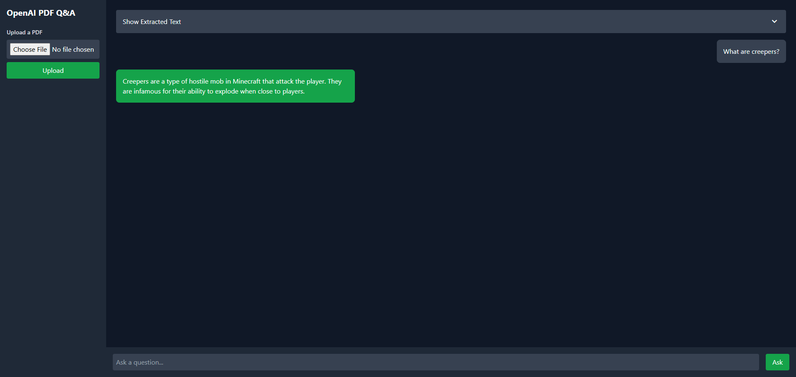

# 📄 OpenAI PDF Q&A Assistant

**PDF Q&A Assistant** is a lightweight web application that lets users upload a PDF file, extract its text, and interact with it using OpenAI's GPT-4 API. It offers a modern dark mode interface and seamless AI-powered question answering.

---

## 🚀 Features

- 📤 Upload a PDF and extract its text content. (2 sample pdf listed above)
- 📖 View the extracted text in an expandable/collapsible section.
- ❓ Ask questions about the content and get intelligent responses powered by OpenAI GPT-4.
- 🌙 Clean and modern dark mode UI for a smooth user experience.

---

## 🛠️ Tech Stack

### Backend


### Frontend


### PDF Processing


### AI Integration


---

## 📁 Project Structure

```
pdf-qa-app/
├── .env                 # Environment variables (API key)
├── app.py               # Flask application
├── requirements.txt     # Python dependencies
├── templates/
│   └── index.html                          # Main HTML template
├── static/
│   └── screenshots
│       ├───chat-interface.png
|       └──main-interface.png
├─── README.md                              # Project documentation
├─── SamplePDF-Text-Images-Links-9Pages.pdf
└─── SamplePDF-Text-7pages.pdf
```

---

## ✅ Prerequisites

- Python 3.8+
- An OpenAI API key

---

## ⚙️ Setup Instructions

### 1. Clone the Repository
```bash
git clone https://github.com/AbdullahRaoo/OpenAI-PDF-Q-A.git
cd pdf-qa-app
```

### 2. Install Dependencies
```bash
pip install -r requirements.txt
```

### 3. Configure Environment Variables

Create a `.env` file in the root directory and add your OpenAI API key:
```
OPENAI_API_KEY=your_openai_api_key
```

### 4. Run the Application
```bash
python app.py
```
Open your browser and go to: [http://127.0.0.1:5000](http://127.0.0.1:5000)

---

## 🧪 Usage

1. Launch the app in your browser.
2. Upload a PDF file using the provided form.
3. Expand the section to view extracted text (optional).
4. Ask questions related to the document in the input field.
5. Get instant AI-powered answers!

---

## 📸 Screenshots

### **Main Interface**


### **Chat Interaction**


---

## 📦 Dependencies

- `Flask`
- `PyMuPDF`
- `OpenAI`
- `python-dotenv`

---

## 🔐 Environment Variables

| Variable         | Description                        |
|------------------|------------------------------------|
| `OPENAI_API_KEY` | Your OpenAI GPT-4 API key (required) |

---

## 📄 License

This project is licensed under the [MIT License](LICENSE).

---

## 🙌 Acknowledgments

- 🧠 [OpenAI](https://openai.com/) – GPT-4 API  
- 🎨 [Tailwind CSS](https://tailwindcss.com/) – UI styling
